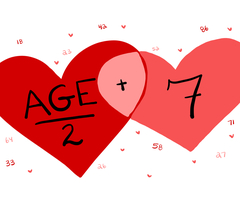

# halfplus7 

Is age just a number? What age is too old or too young to date?

The "Half-Your-Age-Plus-Seven" Rule is sometimes used to decide whether or not the relative ages of individuals in a couple are appropriate. This package provides several functions that apply the Rule to given ages.

`lower_limit` : provides the lower age limit for a given age

`upper_limit` : provides the upper age limit for a given age

`age_range` : provides the appropriate age range for a given age

`check_couple` : provides a verdict about a couple, given their two ages

`ages_firstok` : provides the ages when a couple would first meet the rule, given their birth dates

**Please note:** This package is meant to be silly and *NOT* to provide any absolute judgement about a couple. Relationships are complicated and a super simple mathematical formula about one aspect of the individuals involved shouldn't hold too much weight. Cheers to love and connection at every age! ❤️ 

Example:

> lower_limit(40)
[1] 27

> check_couple(30, 45)
[1] TRUE

> ages_firstok("1800-12-11", "1900-10-25")
  Age of Older Person Age of Younger Person 
             213.7372              113.8686
